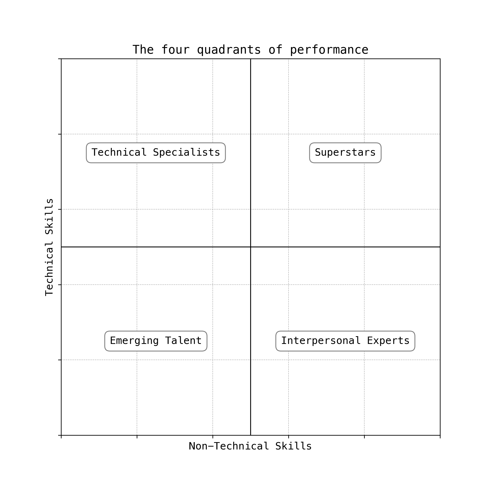

title = "The four quadrants of performance"
date = "2025-08-12"
filename = "performance-quadrants.html"
+++

Jocko Willink says there are only two kinds of leaders: effective and ineffective. The same can be said for workers — they either get the job done or they don’t. While there’s truth to this, it oversimplifies a more complex reality.

To really understand performance, you need to look at it on two scales, which results in four quadrants.

The first scale is technical skills — how well someone performs the core tasks of their role, whether that’s writing quality code, crafting compelling ads, or performing surgeries.

The second scale is non-technical skills — how well someone cooperates with the people they work with or lead. If someone has high technical skills, people might say, “She’s really good at her job.” If someone has high non-technical skills, people might say, “That person is a pleasure to work with.”

Combining these two scales creates four quadrants, as shown below.
* Superstars – high technical and high non-technical skills
* Technical Specialists – high technical but low non-technical skills
* Interpersonal Experts – low technical but high non-technical skills
* Emerging Talent – low in both

Whether you’re an employee or a leader, the goal is the same: get yourself and your team into the top right quadrant—high in both technical and non-technical skills.
* As an employee:
  * If you’re a Technical Specialist, focus on developing interpersonal skills.
  * If you’re an Interpersonal Expert, work on building technical depth.
  * If you’re Emerging Talent, grow in both areas through deliberate practice and feedback.
* As a leader:
  * Hire people who are already there.
  * Develop your current team.
  * Let go of those who are not a good fit.

To improve technical skills, the only real way is through deliberate practice. To improve non-technical skills, I recommend reading Dale Carnegie’s *How to Win Friends and Influence People* or Stephen Covey’s *The 7 Habits of Highly Effective People*, especially the parts about interpersonal skills.

That's it. Simple, but not easy.